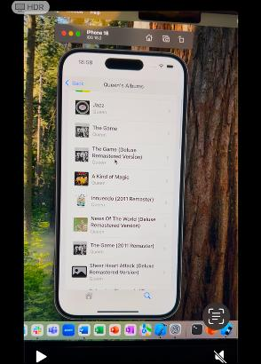

# AlbumFinder

**AlbumFinder** is a SwiftUI iOS application built during my 6-month internship as a starter project to learn iOS development. The app allows users to search for their favorite music albums using the Last.fm API and save them for later viewing. This project helped me explore SwiftUI, SwiftData, RESTful APIs, and local persistence in a real-world context.

---

##  Features

-  **Search Albums** – Search for albums by artist or title via the Last.fm API  
- **Save Favorites** – Save albums locally to view later, even when offline  
- **Album Details** – View album information and cover art  
- **SwiftUI Interface** – Built entirely with SwiftUI for a modern, reactive UI  
- **Local Storage** – Uses SwiftData for saving favorite albums locally  

---

##  Technologies Used

- SwiftUI  
- SwiftData  
- MVVM architecture  
- Last.fm REST API  
- Xcode 16+  
- iOS 18+  

---

## Screenshots

> _Screenshots will be added soon to showcase each screen of the app._

| Home Screen | Search Screen | Album Details | Artists Albums |
|-------------|---------------|----------------|----------------|
|  |  |  |  |

---

## Goals

- Learn SwiftUI and iOS development from scratch  
- Understand networking and data persistence  
- Practice clean architecture (MVVM)  
- Build a real-world portfolio project during my internship  

---

## Setup

1. Clone the repo:

       git clone https://github.com/iriaPM/MusicLibraryApp

2. Open the project in **Xcode 16+**  
3. Run on a device or simulator with **iOS 18+**

---

##  Swift Exercise (Project Brief)

**Swift exercise**:  
Develop an iPhone app in Swift for searching and storing music album information provided by the Last.fm API (https://www.last.fm/api). Similar alternative APIs would be acceptable.

### App Screens

#### Home

Displays all locally stored albums. Tapping an album opens the details page. The navigation bar contains a search icon to access the search view.

####  Search

Allows users to search for artists. Results appear in a list. Selecting an artist opens the albums screen.

####  Albums

Displays a list or grid of albums from the selected artist.  
Features include:

- Store/delete albums locally  
- Visibly mark stored albums  
- Tap to view album details  

Stored data includes:

- Album name  
- Artist  
- Image (or imageURL)  
- Tracks  

####  Details

Displays detailed album information (name, artist, tracks, etc.) with options to store or delete the album.

### Requirements

- Latest Xcode version  
- Latest Swift version  
- iOS 18+  
- API communication using JSON  
- Use `Codable` to serialize JSON  
- Preferred storage: CoreData or SwiftData (UserDefaults is acceptable)

---

##  Other Learning Resources

Apple provides learning material through “Pathways,” a guided way to explore Swift and SwiftUI:

- https://developer.apple.com/pathways/  
- https://developer.apple.com/swift/pathway/  
- https://developer.apple.com/pathways/swiftui/
"""
